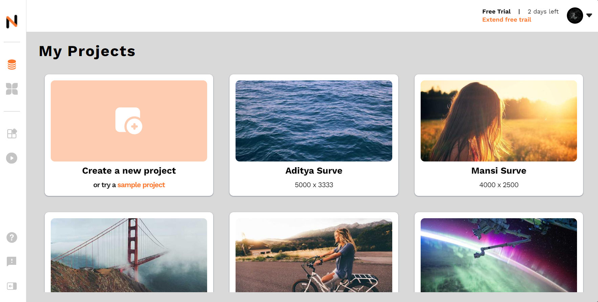

# Seequence Necloe

Welcome to Seequence Necloe, a comprehensive full-stack application designed for managing photo projects. This platform allows users to add, save, and manage their photo projects in an intuitive and user-friendly environment.

## Screenshot

Here is a screenshot of the Seequence Necloe application:

## Technology Stack

Seequence Necloe is built using a robust and modern technology stack:

- **React (Vite)**: The frontend of the application is built using React, a JavaScript library renowned for its efficiency in building interactive UIs. Vite, a next-generation frontend tooling, is used for its fast and lean development experience.

- **NestJS**: The backend logic of the application is handled by NestJS, a progressive Node.js framework that offers a robust groundwork for scalable server-side applications.

- **PostgreSQL**: PostgreSQL, a powerful, open-source object-relational database system, is used for data storage. It ensures data integrity and supports complex queries.

- **PrismaORM**: Prisma ORM (Object-Relational Mapping) is used to interact with the PostgreSQL database. It offers a clean and easy-to-use API for querying the database.

- **TailwindCSS**: The application's styling is handled by TailwindCSS, a utility-first CSS framework that allows for highly customizable designs.

## Features

Seequence Necloe comes packed with a variety of features:

1. **API Fetch**: The application integrates with external APIs to fetch data, providing a seamless and dynamic user experience.

2. **CRUD for Projects**: Users can create, read, update, and delete their photo projects. This CRUD functionality ensures users have full control over their projects.

3. **CRUD for Feedback**: Feedback is crucial for continuous improvement. Users can create, read, update, and delete feedback for their projects.

4. **Deployment**: The application is deployed and accessible online, ready for use at any time.

5. **Responsiveness**: The application is designed to be responsive, ensuring a seamless user experience across various devices and screen sizes.

6. **Animations**: Animations are incorporated throughout the application to enhance user interaction and engagement.

7. **Protected Backend**: Security is a priority. The backend is protected and can only be accessed from the frontend URL, preventing unauthorized access.

We hope you enjoy using Seequence Necloe and find it useful for managing your photo projects.
